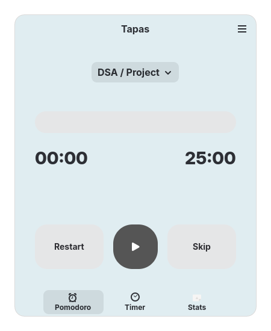
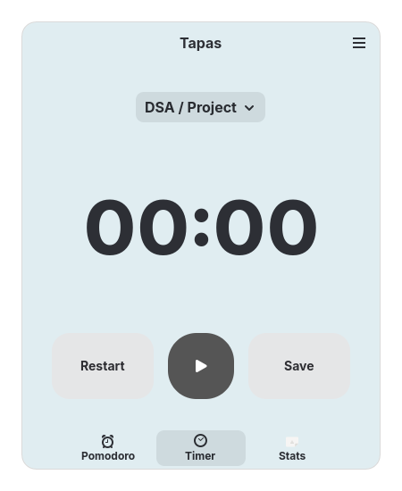

# Tapas

Tapas is a modern, beautifully designed Pomodoro and time-tracking application for the GNOME desktop, built with Python, GTK4, and Libadwaita.

## Screenshots

**Pomodoro Screen**


**Timer Screen**


## Main Features
- **Pomodoro Timer**: Classic focus/break intervals to boost productivity.
- **Website Blocking**: Eliminate distractions during focus sessions.
- **Projects & Tags**: Organize your tasks logically.
- **Statistics**: Track your focus times and habits.

## Building and Running
Currently in early development. You can run the app directly via Python:

```bash
./main.py
```
